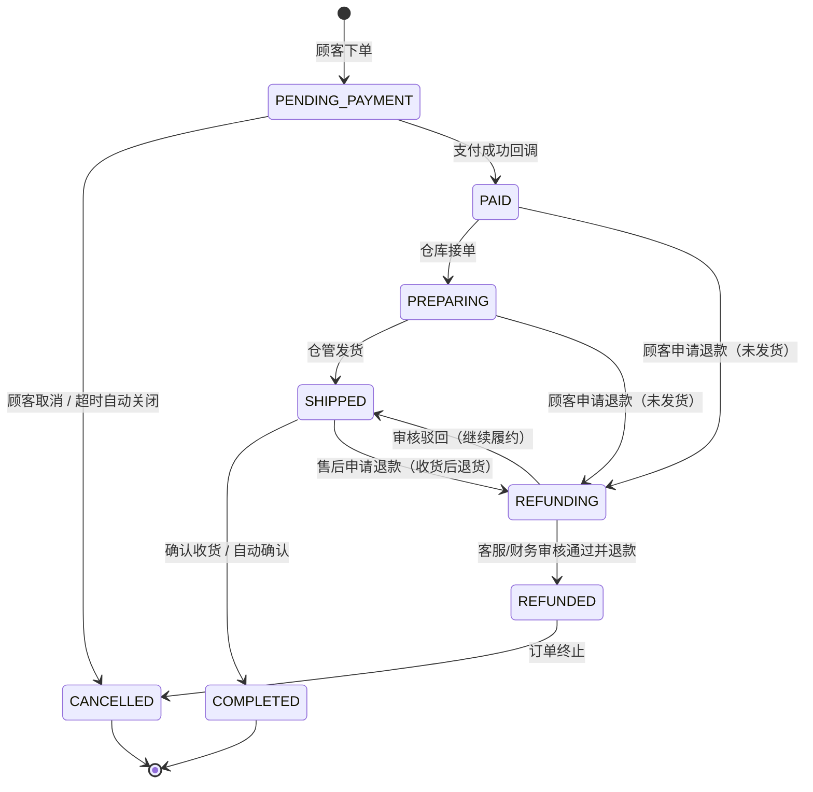

# 电商订单履约系统 产品需求文档（PRD）

| 项目 | 内容 |
| --- | --- |
| 文档名称 | 电商订单履约系统产品需求文档（PRD） |
| 版本 | v1.0 |
| 状态 | 评审稿 |
| 编写日期 | 2026-08-10 |
| 产品负责人 | 电商平台产品组 |
| 相关系统 | 订单中心、库存系统、支付系统、履约中心 |

---

## 1. 背景与目标

### 1.1 背景
电商平台现有下单流程分散在多个手工/半自动环节中，缺乏统一的订单履约视图。订单从支付到发货、完成，再到售后退款，缺少标准化的状态流转与跨角色协作机制，导致：
- 订单状态不透明，顾客无法准确感知履约进度；
- 客服、仓管、财务各管一段，信息割裂，退款/改单靠线下沟通；
- 库存与订单未实时联动，存在超卖或库存不一致风险；
- 对账依赖人工导表，差错发现滞后。

### 1.2 目标
- 建立标准化的订单生命周期状态机，覆盖从下单到完成/退款的全程；
- 打通「订单—库存—支付」三大核心链路，实现数据实时联动；
- 为四类角色（顾客、客服、仓管、财务）提供清晰的职责边界与操作入口；
- 实现退款、对账流程的线上化、可追踪、可审计。

### 1.3 成功指标
- 订单状态实时更新延迟 ≤ 5 秒；
- 超卖率降为 0（库存预占 + 支付后扣减）；
- 退款平均处理时长 ≤ 24 小时；
- 日终对账差错率 ≤ 0.01%，异常可追溯。

---

## 2. 范围

### 2.1 本期范围
- 订单创建、支付、履约（备货/发货）、完成、取消、退款全流程；
- 四类角色的操作台与权限体系；
- 与库存系统、支付系统的对接；
- 对账与审计日志。

### 2.2 不在本期范围
- 营销活动（优惠券、秒杀）的订单规则引擎；
- 物流轨迹的实时地图展示（仅保留运单号与状态）；
- 多仓调拨与智能分仓（本期固定单仓逻辑）。

---

## 3. 角色定义

| 角色 | 英文标识 | 说明 |
| --- | --- | --- |
| 普通顾客 | CUSTOMER | 在平台下单、支付、催单、申请退款的终端用户 |
| 客服 | CS_AGENT | 处理改单（地址/商品变更）、审核退款、处理催单 |
| 仓管 | WAREHOUSE | 执行发货、盘点库存、维护库存可用量 |
| 财务 | FINANCE | 负责日终对账、退款复核、资金流水核对 |

---

## 4. 订单状态机

### 4.1 状态定义

| 状态码 | 状态名 | 含义 |
| --- | --- | --- |
| PENDING_PAYMENT | 待支付 | 订单已创建，等待顾客支付 |
| PAID | 已支付 | 支付成功，等待仓库备货 |
| PREPARING | 备货中 | 仓库已接单，拣货/打包中 |
| SHIPPED | 已发货 | 已出库并填写运单号 |
| COMPLETED | 已完成 | 顾客确认收货或系统自动确认，订单完结 |
| CANCELLED | 已取消 | 支付前取消，或支付后退款完成 |
| REFUNDING | 退款中 | 已支付订单进入退款流程 |
| REFUNDED | 已退款 | 退款成功，资金退回顾客 |

### 4.2 状态流转图



### 4.3 流转规则
- **待支付超时**：超过 30 分钟未支付，系统自动关闭订单并释放库存预占；
- **支付前取消**：顾客可随时取消待支付订单，库存预占立即释放；
- **支付后取消/退款**：已支付订单需走退款流程，由客服审核（涉及资金必须留痕）；
- **发货后**：默认 7 天自动确认收货（可配置）；
- **状态不可逆**：除「退款驳回 → 继续履约」外，状态机不允许逆向跳转；
- 所有状态变更记录变更人、变更时间、变更原因，写入订单流水（audit trail）。

---

## 5. 功能需求

### 5.1 普通顾客端（C端）

| 编号 | 功能 | 需求说明 | 优先级 |
| --- | --- | --- | --- |
| C-01 | 下单 | 选择商品 → 提交订单 → 创建待支付订单；下单时实时校验并**预占库存**；支持订单金额试算 | P0 |
| C-02 | 支付 | 跳转收银台完成支付；支付成功后订单状态置为「已支付」 | P0 |
| C-03 | 催单 | 已支付/备货中订单可发起催单；生成催单工单推送给客服与仓管 | P1 |
| C-04 | 取消订单 | 待支付状态可直接取消；已支付状态申请退款取消 | P0 |
| C-05 | 申请退款 | 已支付未发货可申请全额退款；已发货可申请售后（退货退款） | P0 |
| C-06 | 订单查询 | 查看订单详情、状态流转时间线、运单号、退款进度 | P0 |
| C-07 | 消息通知 | 状态变更（支付成功/发货/退款结果）通过站内信+短信通知 | P1 |

### 5.2 客服工作台

| 编号 | 功能 | 需求说明 | 优先级 |
| --- | --- | --- | --- |
| K-01 | 订单查询 | 按订单号/顾客/手机号/状态多条件检索订单 | P0 |
| K-02 | 改单 | 未发货订单可修改收货地址、联系电话、发票信息；**改商品数量/金额需风控二次确认** | P0 |
| K-03 | 退款审核 | 审核顾客退款申请：通过（进入打款）/驳回（需填写原因）；未发货退款自动通过规则可配置 | P0 |
| K-04 | 催单处理 | 查看催单工单，督办仓管优先发货，回复顾客处理结果 | P1 |
| K-05 | 备注与工单 | 订单加内部备注，全程留痕 | P1 |

### 5.3 仓管端（WMS 侧）

| 编号 | 功能 | 需求说明 | 优先级 |
| --- | --- | --- | --- |
| W-01 | 备货接单 | 已支付订单进入备货队列；仓管领取任务 | P0 |
| W-02 | 发货 | 拣货打包后，填写运单号并确认发货，订单置为「已发货」，**扣减实际库存** | P0 |
| W-03 | 盘点 | 支持周期盘点/抽盘；盘点差异生成差异单并同步库存系统 | P1 |
| W-04 | 库存看板 | 查看库存余量、占用（预占）量、预警库存；低于阈值告警 | P1 |
| W-05 | 发货异常 | 缺货/破损时标记异常单，触发客服介入（改单/退款） | P1 |

### 5.4 财务端

| 编号 | 功能 | 需求说明 | 优先级 |
| --- | --- | --- | --- |
| F-01 | 日终对账 | 每日拉取支付流水与订单流水自动对账，输出差异清单 | P0 |
| F-02 | 退款复核 | 大额/异常退款二次复核；退款结果回写订单 | P0 |
| F-03 | 资金报表 | 收入、退款、净额、手续费等维度报表导出 | P1 |
| F-04 | 异常处理 | 对账差异标记、人工处理留痕 | P1 |

---

## 6. 架构设计

### 6.1 总体架构（分层）

```
┌─────────────────────────────────────────────────────┐
│  接入层   顾客App/小程序 ｜ 客服工作台 ｜ 仓管端 ｜ 财务端  │
└────────────────────────┬────────────────────────────┘
                         │ API Gateway（鉴权/限流/路由）
┌────────────────────────▼────────────────────────────┐
│  应用层（微服务）                                      │
│  ┌─────────┐ ┌─────────┐ ┌─────────┐ ┌───────────┐   │
│  │ 订单服务 │ │ 支付服务 │ │ 库存服务 │ │ 履约/物流 │   │
│  └─────────┘ └─────────┘ └─────────┘ └───────────┘   │
│  ┌─────────┐ ┌─────────┐ ┌─────────┐                │
│  │ 售后/退款│ │ 对账服务 │ │ 通知服务 │                │
│  └─────────┘ └─────────┘ └─────────┘                │
└────────────────────────┬────────────────────────────┘
                         │ 消息队列（异步解耦）
┌────────────────────────▼────────────────────────────┐
│  数据层                                               │
│  订单库 ｜ 支付流水库 ｜ 库存库 ｜ 审计日志库 ｜ 缓存      │
└─────────────────────────────────────────────────────┘
```

### 6.2 关键设计决策
- **订单服务为状态机权威源**：所有状态变更必须通过订单服务的状态机接口，禁止其他服务直改订单状态；
- **库存预占与扣减分离**：下单预占（锁定可用量）→ 发货扣减（实际出库），避免超卖同时保证可售量准确；
- **支付异步回调**：支付结果通过回调 + 主动查询双通道确认，保证支付状态最终一致；
- **事件驱动**：状态变更发布领域事件（OrderPaid / OrderShipped / RefundApproved 等），下游服务订阅，降低耦合；
- **对账独立**：对账服务独立于业务链路，比对支付流水与订单流水，保证资金一致。

### 6.3 集成架构
```
订单服务 ──► 库存系统（预占/释放/扣减/查询）
订单服务 ──► 支付系统（下单支付/退款发起/退款查询/流水查询）
履约服务 ──► 物流系统（运单号回写/物流状态订阅）
```

---

## 7. 数据流

### 7.1 下单 → 支付数据流
```
顾客提交订单
  → 订单服务创建订单（状态: 待支付）
  → 调用库存服务【预占库存】(TCC/Redis 扣减可用量)
  → 预占成功则生成支付单，返回收银台
  → 顾客支付 → 支付系统回调
  → 订单服务校验签名/金额 → 状态置为「已支付」
  → 发布 OrderPaid 事件
  → 通知服务推送支付成功消息
  → 备货队列生成履约任务（仓管端可见）
```

### 7.2 履约（备货/发货）数据流
```
仓管领取备货任务（状态: 备货中）
  → 拣货打包 → 填写运单号
  → 履约服务调用库存服务【扣减库存】
  → 扣减成功 → 订单状态置为「已发货」
  → 发布 OrderShipped 事件
  → 通知顾客（含运单号）
  → 顾客确认收货/自动确认 → 状态置为「已完成」
```

### 7.3 退款数据流
```
顾客发起退款申请（状态: 退款中）
  → 订单服务生成退款单
  → 未发货: 释放库存预占 → 转客服审核
  → 已发货: 走售后（退货签收后）→ 客服审核
  → 审核通过 → 调用支付系统【发起退款】
  → 支付系统退款成功回调 → 订单状态置为「已退款」
  → 发布 RefundCompleted 事件 → 通知顾客
  → 审核驳回 → 订单回到原状态继续履约
```

### 7.4 对账数据流
```
日终触发
  → 对账服务拉取支付系统流水（支付+退款）
  → 比对订单服务订单流水（金额/时间/状态）
  → 生成对账报告: 一致项 / 差异项（长款/短款/状态不一致）
  → 差异项进入财务工作台人工处理
  → 处理后留痕归档
```

### 7.5 库存联动数据流
```
下单预占 ──► 可用量 -1
取消/退款 ──► 释放预占，可用量 +1
发货 ──► 预占转实际扣减，在库量 -1
盘点 ──► 校正账面库存，差异单进入库存系统
```

---

## 8. 权限设计

### 8.1 权限模型
RBAC（基于角色的访问控制）：用户 → 角色 → 权限点。权限点按「模块:操作」粒度控制，所有写操作记录审计日志。

### 8.2 权限矩阵

| 功能模块 | 操作 | 顾客 | 客服 | 仓管 | 财务 |
| --- | --- | --- | --- | --- | --- |
| 订单 | 创建订单 | ✔ | ✖ | ✖ | ✖ |
| 订单 | 查看订单 | 本人订单 | 全部 | 履约相关 | 全部(只读) |
| 订单 | 取消订单 | 本人待支付 | ✔(未发货) | ✖ | ✖ |
| 订单 | 修改订单(改单) | ✖ | ✔(未发货,风控确认) | ✖ | ✖ |
| 支付 | 发起支付 | 本人订单 | ✖ | ✖ | ✖ |
| 催单 | 发起催单 | ✔ | ✖ | ✖ | ✖ |
| 催单 | 处理催单 | ✖ | ✔ | ✔(优先发货) | ✖ |
| 履约 | 备货/发货 | ✖ | 查看 | ✔ | ✖ |
| 库存 | 盘点/调库存 | ✖ | 查看 | ✔ | 查看 |
| 售后 | 申请退款 | ✔ | ✖ | ✖ | ✖ |
| 售后 | 审核退款 | ✖ | ✔ | ✖ | ✖(大额复核✔) |
| 售后 | 退款打款/复核 | ✖ | 发起 | ✖ | ✔(复核) |
| 对账 | 日终对账 | ✖ | ✖ | ✖ | ✔ |
| 对账 | 差异处理 | ✖ | ✖ | ✖ | ✔ |
| 报表 | 资金报表 | ✖ | ✖ | ✖ | ✔ |
| 审计 | 审计日志 | ✖ | 查看 | 查看 | 查看(全部) |

### 8.3 权限要点
- **顾客越权防护**：顾客只能访问本人订单，服务端强制校验订单归属（防止水平越权）；
- **资金操作分离**：退款审核（客服）与退款打款复核（财务）职责分离，避免单人操作资金闭环；大额退款（≥ ¥5000）强制财务复核；
- **改单风控**：修改商品/金额等敏感变更需二次确认并留痕；
- **最小权限**：仓管不接触资金数据，财务不操作库存，客服不操作盘点；
- **审计**：所有写操作（状态变更、改单、退款审核、盘点差异）写入审计日志，支持按订单号/操作人追溯。

---

## 9. 非功能需求

| 维度 | 需求 |
| --- | --- |
| 性能 | 下单接口 P99 < 300ms；订单查询 P99 < 500ms；状态变更实时推送 ≤ 5s |
| 可用性 | 核心链路（下单/支付回调）可用性 ≥ 99.95%；故障时库存预占降级为「下单不锁库存」+ 人工复核 |
| 一致性 | 支付回调与订单状态最终一致；库存预占/扣减保证不超卖（Redis 原子扣减 + 数据库兜底对账） |
| 安全 | 接口鉴权（JWT/OAuth2）、支付签名校验、敏感信息脱敏（手机号/地址部分掩码） |
| 审计 | 审计日志保留 ≥ 2 年，不可篡改（追加式存储） |
| 扩展性 | 服务无状态可水平扩展；消息队列削峰（大促下单峰值 10 倍流量） |
| 合规 | 退款原路返回；资金流水与对账数据符合财务审计要求 |

---

## 10. 接口与集成约定（概要）

### 10.1 库存系统接口
| 接口 | 方向 | 说明 |
| --- | --- | --- |
| 预占库存 reserve() | 订单→库存 | 下单时锁定库存，返回成功/失败 |
| 释放预占 release() | 订单→库存 | 取消/退款时释放 |
| 扣减库存 deduct() | 履约→库存 | 发货出库扣减 |
| 查询库存 query() | 各端→库存 | 可用量/预占量/在库量 |
| 盘点同步 adjust() | 仓管→库存 | 盘点差异校正 |

### 10.2 支付系统接口
| 接口 | 方向 | 说明 |
| --- | --- | --- |
| 创建支付单 createPayment() | 订单→支付 | 生成收银台支付单 |
| 支付回调 notify() | 支付→订单 | 异步通知支付结果 |
| 发起退款 refund() | 订单→支付 | 原路退款 |
| 退款回调 refundNotify() | 支付→订单 | 退款结果通知 |
| 拉取流水 queryTransactions() | 对账→支付 | 日终对账拉单 |

---

## 11. 风险与假设

### 11.1 风险
| 风险 | 影响 | 应对 |
| --- | --- | --- |
| 支付回调延迟/丢失 | 订单卡在待支付 | 主动查询补偿 + 定时对账兜底 |
| 库存预占与扣减不一致 | 超卖/少卖 | 原子扣减 + 日终库存对账 |
| 退款资金风险 | 资损 | 审核/打款职责分离 + 大额复核 |
| 大促流量峰值 | 下单延迟 | 消息队列削峰 + 弹性扩容 |
| 改单导致金额/库存偏差 | 对账差异 | 风控二次确认 + 全程留痕 |

### 11.2 假设
- 本期为单仓逻辑，多仓分仓不在本期范围；
- 支付系统支持退款回调与流水拉取能力（已有第三方支付通道）；
- 库存系统可提供预占/释放/扣减能力，若暂不支持则先由订单服务本地预占、库存日终同步（降级方案）。

---

## 12. 里程碑（建议）

| 阶段 | 内容 | 周期 |
| --- | --- | --- |
| M1 需求评审 | PRD 评审、状态机与权限确认 | 第 1 周 |
| M2 核心链路 | 下单/支付/状态机/库存预占 | 第 2-4 周 |
| M3 履约与售后 | 发货/退款/催单/客服工作台 | 第 5-7 周 |
| M4 财务与对账 | 对账服务/报表/复核 | 第 8-9 周 |
| M5 联调上线 | 全链路联调、UAT、灰度上线 | 第 10-12 周 |

---

## 附录

### 附录 A：订单状态变更事件清单
| 事件 | 触发时机 | 消费者 |
| --- | --- | --- |
| OrderCreated | 下单成功 | 库存(预占)、通知 |
| OrderPaid | 支付回调成功 | 履约(建备货任务)、通知 |
| OrderShipped | 发货确认 | 通知、物流 |
| OrderCompleted | 确认收货 | 财务(收入确认) |
| RefundRequested | 顾客申请退款 | 客服(待审队列) |
| RefundApproved / Rejected | 审核结果 | 支付(打款)、通知 |
| RefundCompleted | 退款成功 | 财务(对账)、库存(释放) |

### 附录 B：术语表
| 术语 | 定义 |
| --- | --- |
| 预占库存 | 下单时锁定库存，防止超卖，支付前不扣减实际库存 |
| 履约 | 从订单支付成功到发货完成的仓库作业过程 |
| 原路退回 | 退款按原支付渠道返回顾客账户 |
| 对账差异 | 支付流水与订单流水不一致的记录项 |
