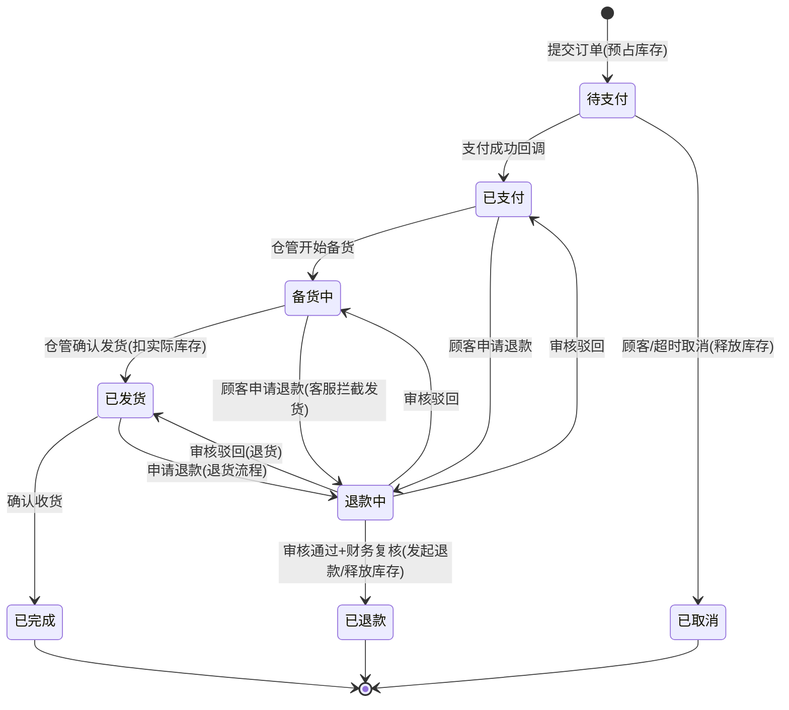
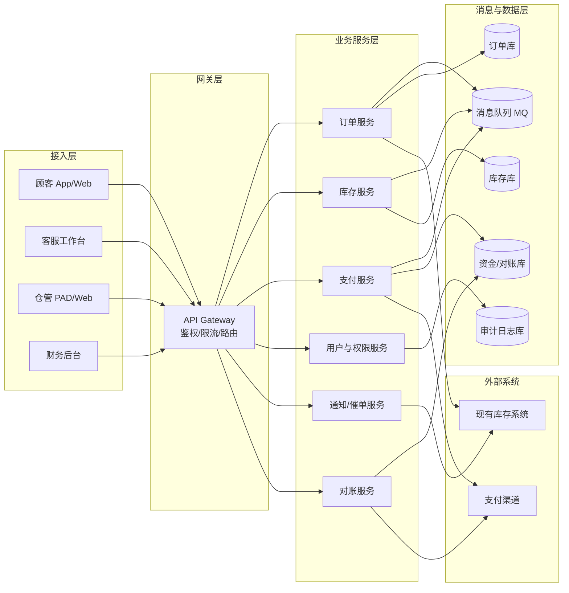
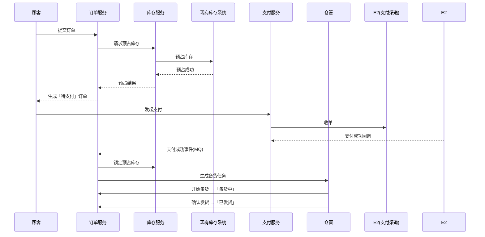

# 电商订单履约系统产品需求文档（PRD）

| 项目 | 内容 |
|---|---|
| 文档名称 | 电商订单履约系统 PRD |
| 版本 | v1.0（初稿） |
| 状态 | 待评审 |
| 作者 | 产品部 |
| 日期 | 2026-08-10 |
| 适用范围 | 电商平台订单履约全链路（下单 → 支付 → 备货 → 发货 → 完成） |

---

## 1. 背景与目标

### 1.1 业务背景
电商平台订单量持续增长，当前订单处理依赖人工与分散工具，缺乏统一的履约管理，存在以下问题：

- 订单状态不透明，顾客催单、退款响应慢，体验差；
- 订单与库存不同步，超卖/缺货频发，履约失败率高；
- 财务对账依赖人工核对，差错率高、时效差；
- 各岗位权限边界模糊，存在越权操作与资损风险。

### 1.2 产品目标
- 建立统一的订单履约系统，覆盖「下单 → 支付 → 备货 → 发货 → 完成」全流程；
- 对接现有**库存系统**与**支付系统**，实现库存预占/释放/扣减、支付/退款自动化的无缝集成；
- 建立清晰的 **RBAC 权限体系**，四类角色（顾客/客服/仓管/财务）各司其职、操作可审计；
- 订单全链路可追踪，财务对账自动化。

### 1.3 成功指标（北极星/核心 KPI）
| 指标 | 目标值 |
|---|---|
| 订单履约自动化率 | ≥ 90% |
| 超卖率 | 0（库存强校验） |
| 退款处理时效 | ≤ 24 小时 |
| 对账差错率 | ≤ 0.01% |

---

## 2. 术语定义

| 术语 | 定义 |
|---|---|
| 订单（Order） | 顾客一次购买行为的业务单据，含一个或多个订单项 |
| 履约（Fulfillment） | 订单从下单到送达/完成的执行过程 |
| SKU | 库存最小管理单元（商品粒度） |
| 库存预占 | 下单时锁定库存，防止超卖 |
| 退款单（Refund） | 订单退款申请及执行单据 |
| 对账单（Reconciliation） | 平台与支付渠道之间的资金核对记录 |

---

## 3. 用户角色与权限

### 3.1 角色定义

| 角色 | 角色编码 | 说明 |
|---|---|---|
| 普通顾客 | CUSTOMER | 平台 C 端用户：下单、支付、催单、申请退款 |
| 客服 | CS_AGENT | 处理改单、退款审核、取消拦截、催单跟进 |
| 仓管 | WAREHOUSE | 负责发货、拣货/打包/出库、库存盘点 |
| 财务 | FINANCE | 负责支付/退款对账、资金核对、报表导出 |

### 3.2 权限矩阵（RBAC：用户-角色-权限）

| 功能模块 | 具体权限 | 普通顾客 | 客服 | 仓管 | 财务 |
|---:|---|---|---|---|---|
| 下单 | 创建订单（自助/代客下单） | ✅ 自助 | ✅ 代客 | ❌ | ❌ |
| 支付 | 发起支付、查看支付结果 | ✅ | ❌ | ❌ | ❌ |
| 催单 | 发起催单、查看催单进度 | ✅ | ✅ 处理 | ❌ | ❌ |
| 取消订单 | 取消未发货订单 | ✅（限待支付/已支付） | ✅（含备货中拦截） | ❌ | ❌ |
| 退款 | 申请退款 | ✅ | ✅ 代客申请 | ❌ | ❌ |
| 退款审核 | 审核/驳回退款单 | ❌ | ✅ 初审 | ❌ | ✅ 大额复核 |
| 改单 | 修改地址/电话/商品/价格 | ❌ | ✅（商品/价格需审批） | ❌ | ❌ |
| 发货 | 备货、出库、生成物流单 | ❌ | ❌ | ✅ | ❌ |
| 库存盘点 | 盘点、差异调整 | ❌ | ❌ | ✅（调整需审批） | ❌ |
| 库存预警 | 查看低库存/超卖预警 | ❌ | ❌ | ✅ | ❌ |
| 对账 | 拉取流水、勾稽、差异处理 | ❌ | ❌ | ❌ | ✅ |
| 报表 | 对账/资金报表导出 | ❌ | ❌ | ❌ | ✅ |
| 订单查询 | 查看订单详情 | ✅（本人订单） | ✅（授权范围） | ✅（本仓发货单） | ✅（资金相关） |

### 3.3 权限控制要点
1. **模型**：RBAC 三级模型（用户 → 角色 → 权限），遵循最小权限原则。
2. **接口级鉴权**：所有写操作经网关鉴权；敏感操作（改单、退款审核、盘点调整、对账导出）需二次校验（短信/内部审批流）。
3. **数据权限**：
   - 顾客仅可见本人订单；
   - 仓管仅可见本仓/本班次的发货任务与库存数据；
   - 财务仅可见资金、对账相关数据；
   - 客服可处理被授权范围内的订单。
4. **审计日志**：所有角色关键操作记录操作人、操作时间、变更前后值、来源 IP，保留 ≥ 180 天。

---

## 4. 订单状态机

### 4.1 状态定义

| 状态编码 | 名称 | 说明 |
|---|---|---|
| PENDING_PAYMENT | 待支付 | 已下单、库存已预占，未支付 |
| PAID | 已支付 | 支付成功，待仓管备货 |
| PREPARING | 备货中 | 仓管拣货/打包中 |
| SHIPPED | 已发货 | 已出库，物流在途 |
| COMPLETED | 已完成 | 顾客确认收货或系统自动确认 |
| CANCELLED | 已取消 | 未支付取消或中途取消 |
| REFUNDING | 退款中 | 退款申请审核/执行中 |
| REFUNDED | 已退款 | 退款已完成 |

### 4.2 状态流转图（Mermaid）



### 4.3 状态流转规则表

| 当前状态 | 触发动作 | 操作角色 | 目标状态 | 系统动作 |
|---|---|---|---|---|
| （新建） | 提交订单 | 顾客/客服代客 | 待支付 | 校验并预占库存、生成订单 |
| 待支付 | 支付成功回调 | 支付系统 | 已支付 | 确认收款、锁定预占库存、通知备货 |
| 待支付 | 取消订单 | 顾客/客服 | 已取消 | 释放库存预占 |
| 待支付 | 超时未支付（30 分钟） | 系统定时任务 | 已取消 | 释放库存预占 |
| 已支付 | 开始备货 | 仓管 | 备货中 | 生成拣货任务 |
| 备货中 | 确认发货 | 仓管 | 已发货 | 生成物流单、扣减实际库存 |
| 已发货 | 确认收货 | 顾客/系统自动 | 已完成 | 订单完结、触发结算 |
| 已支付 | 申请退款 | 顾客/客服代客 | 退款中 | 生成退款单、冻结订单、通知客服 |
| 备货中 | 申请退款 | 顾客/客服代客 | 退款中 | 拦截发货、生成退款单 |
| 已发货 | 申请退款 | 顾客 | 退款中 | 进入退货退款流程 |
| 退款中 | 审核通过 | 客服（大额需财务复核） | 已退款 | 释放库存、调用支付系统退款 |
| 退款中 | 审核驳回 | 客服 | 原状态 | 恢复订单状态 |
| 任意未发货态 | 客服强制取消 | 客服（需审批） | 已取消 | 释放库存、原路退款（如已支付） |

### 4.4 状态机约束
- 状态迁移必须经系统校验，**禁止跳级或非法回退**；
- 已发货订单不可直接取消，只能走退货退款流程；
- 任何取消/退款动作必须同步处理库存（释放预占或回补），保证库存最终一致；
- 所有迁移写入状态变更流水表，供追溯。

---

## 5. 功能需求

### 5.1 普通顾客端（C 端）
| 编号 | 功能 | 需求描述 |
|---|---|---|
| FR-C1 | 下单 | 选择商品 → 实时库存校验 → 预占库存 → 生成「待支付」订单；30 分钟未支付自动取消 |
| FR-C2 | 支付 | 对接支付系统发起支付，展示支付结果；支付失败可重试 |
| FR-C3 | 催单 | 对「备货中/已发货」订单发起催单，系统生成催单工单通知仓管/客服 |
| FR-C4 | 取消订单 | 「待支付/已支付」未备货订单可自助取消，库存即时释放 |
| FR-C5 | 申请退款 | 「已支付」后可申请退款（未发货：仅退款；已发货：退货退款） |
| FR-C6 | 订单查询 | 查看订单状态、金额、物流轨迹、退款进度 |

### 5.2 客服端
| 编号 | 功能 | 需求描述 |
|---|---|---|
| FR-S1 | 订单查询 | 按订单号/手机号/顾客查询订单，查看全链路状态 |
| FR-S2 | 改单 | 地址/联系电话修改免审批；商品/价格修改需上级审批并触发风控 |
| FR-S3 | 退款审核 | 审核退款单并执行退款/驳回；**大额（≥ 阈值）需财务复核** |
| FR-S4 | 取消拦截 | 「备货中」订单取消时拦截仓管发货，确认未出库才允许取消 |
| FR-S5 | 催单处理 | 查看催单队列，跟进并回复处理结果 |
| FR-S6 | 异常处理 | 支付异常、超卖、物流异常订单的登记与处理 |

### 5.3 仓管端
| 编号 | 功能 | 需求描述 |
|---|---|---|
| FR-W1 | 发货处理 | 接收备货任务 → 拣货 → 打包 → 出库 → 生成物流单，状态置为「已发货」 |
| FR-W2 | 库存盘点 | 周期性盘点（PDA 扫码），盘点差异生成调整单，需审批后生效 |
| FR-W3 | 库存预警 | 低库存预警、超卖预警、异常库存提示 |

### 5.4 财务端
| 编号 | 功能 | 需求描述 |
|---|---|---|
| FR-F1 | 支付对账 | 拉取支付渠道流水与平台订单流水自动勾稽，输出差异清单 |
| FR-F2 | 退款对账 | 退款单流水与支付渠道退款流水核对 |
| FR-F3 | 差异处理 | 差异单标记、查询、人工调整、归档 |
| FR-F4 | 报表导出 | 日/月对账报表、资金汇总报表导出（Excel/CSV） |

### 5.5 系统对接需求
| 外部系统 | 交互能力 | 说明 |
|---|---|---|
| 现有库存系统 | 预占 / 释放 / 扣减 / 回补 / 库存查询 | 下单预占、取消释放、发货扣减、退款回补 |
| 现有支付系统 | 发起支付 / 支付回调 / 发起退款 / 退款回调 / 对账文件 | 支付与退款均需幂等处理 |

---

## 6. 系统架构

### 6.1 架构图（Mermaid）



### 6.2 架构说明
- **接入层**：四类角色分别使用不同终端（C 端 App/Web、客服工作台、仓管 PAD、财务后台），统一走 API Gateway。
- **网关层**：统一鉴权（JWT + RBAC 校验）、限流、路由、日志。
- **业务服务层**：按领域拆分微服务，服务间通过 MQ 事件驱动异步解耦。
- **数据层**：按领域分库，核心写操作落审计日志。
- **外部系统**：库存系统、支付渠道通过标准化 REST/回调接口对接。

### 6.3 关键设计决策
1. **微服务 + 事件驱动**：支付成功、发货、退款等通过 MQ 发布事件，异步驱动下游，避免长事务与强耦合。
2. **幂等设计**：支付回调、退款回调均以「业务单号 + 事件 ID」幂等，重复回调不产生副作用。
3. **库存一致性**：下单预占 → 支付锁定 → 发货扣减 → 取消/退款释放，配合事务消息与定时补偿任务保证最终一致。
4. **对账补偿**：对账任务作为兜底，修复支付回调丢失导致的订单状态卡死。

---

## 7. 数据流

### 7.1 下单主流程（时序图）



### 7.2 支付数据流
```
顾客发起支付 → 支付服务创建支付单 → 调用支付渠道收单
→ 渠道异步回调(幂等校验) → 更新支付单/订单状态(已支付)
→ 发布「支付成功」事件(MQ) → 订单服务锁定库存 + 通知备货
→ 定时对账任务拉取渠道流水，与支付单勾稽，兜底修复漏单
```

### 7.3 退款数据流
```
顾客申请退款 → 生成退款单(REFUNDING, 冻结订单)
→ 客服初审 → 大额触发财务复核
→ 审核通过 → 释放/回补库存 + 调用支付渠道发起退款
→ 渠道退款回调(幂等校验) → 更新退款单/订单状态(已退款/已取消)
→ 定时对账任务核对退款流水
```

### 7.4 发货数据流
```
订单「已支付」→ 生成备货任务 → 仓管拣货/打包
→ 出库 → 扣减实际库存(库存服务) → 生成物流单
→ 订单状态置「已发货」→ 发布事件 → 通知顾客物流单号
```

### 7.5 对账数据流
```
对账任务(定时) → 拉取支付渠道流水文件 → 拉取平台支付/退款单
→ 按 单号+金额 自动勾稽 → 生成差异清单
→ 财务人工处理差异(查询/调整/归档) → 输出日/月对账报表
```

---

## 8. 数据模型（核心表概要）

| 表 | 关键字段 | 说明 |
|---|---|---|
| orders | id, order_no, user_id, status, total_amount, paid_at, cancelled_at, completed_at | 订单主表 |
| order_items | id, order_id, sku_id, quantity, unit_price, subtotal | 订单明细 |
| order_status_log | id, order_id, from_status, to_status, operator, op_time, remark | 状态流转流水（审计） |
| payments | id, payment_no, order_id, channel, amount, status, callback_id | 支付单 |
| refunds | id, refund_no, order_id, payment_id, amount, status, reviewer, finance_reviewer | 退款单 |
| shipments | id, shipment_no, order_id, logistics_company, tracking_no, shipped_at | 发货/物流单 |
| inventory | sku_id, warehouse_id, available_qty, locked_qty, total_qty | 库存（可用/锁定/总量） |
| inventory_log | id, sku_id, change_type, change_qty, order_no, operator, op_time | 库存流水 |
| reconciliation_records | id, biz_date, channel, total_orders, total_amount, diff_count, status | 对账记录 |
| users / roles / permissions | 用户、角色、权限、用户-角色关联 | RBAC 权限模型 |

---

## 9. 非功能需求

| 类别 | 要求 |
|---|---|
| 性能 | 下单接口 P99 ≤ 500ms；订单查询 P99 ≤ 1s；库存扣减事务耗时 ≤ 200ms |
| 可用性 | 核心链路（下单/支付/发货）可用性 ≥ 99.9%；故障恢复 RTO ≤ 30min |
| 一致性 | 库存与订单最终一致；支付/退款回调幂等；禁止超卖 |
| 安全 | 全链路 HTTPS；支付、退款等敏感接口签名校验；敏感数据加密存储；接口防重放 |
| 审计 | 关键操作（改单/退款/盘点/对账调整）全量审计留痕 |
| 合规 | 退款到账时效符合监管要求；支付信息合规存储；顾客隐私（PII）脱敏展示 |

---

## 10. 风险与应对

| 风险 | 影响 | 应对措施 |
|---|---|---|
| 支付回调丢失/延迟 | 订单状态卡在待支付 | 定时对账补偿任务 + 状态自动修复 |
| 库存超卖 | 履约失败、客诉 | 强库存校验 + 预占 + 数据库行锁/乐观锁 |
| 重复支付/重复退款 | 资损 | 幂等键（业务单号+事件ID）全链路校验 |
| 退款金额错误 | 资损与合规风险 | 大额退款财务复核 + 双人审批 |
| 并发扣减库存 | 数据不一致 | 行锁 + 库存流水对账 |
| 改单越权 | 业务风险 | RBAC 鉴权 + 审批流 + 审计日志 |

---

## 11. 里程碑与交付计划

| 里程碑 | 内容 | 周期 |
|---|---|---|
| M1 | 需求评审与原型确认 | 第 1 周 |
| M2 | 订单服务 + 状态机 + 支付对接 | 第 2-3 周 |
| M3 | 库存系统对接 + 仓管发货 | 第 4-5 周 |
| M4 | 退款流程 + 财务对账 | 第 6-7 周 |
| M5 | 全链路联调 + UAT + 上线 | 第 8 周 |

---

## 12. 假设与待确认事项

### 12.1 已采用假设（评审时请确认）
- 现有**库存系统**与**支付系统**为既有系统，提供标准 REST API 与异步回调；
- 权限模型采用 RBAC（用户-角色-权限）；
- 下单采用「库存预占」，支付成功锁定、发货扣减、取消/退款释放；
- 订单默认支付超时 30 分钟自动取消。

### 12.2 待确认事项
- 大额退款复核阈值金额（建议 ¥5,000）；
- 自动确认收货时长（建议发货后 15 天）；
- 对账周期（日/小时）与渠道对账文件格式；
- 改单中商品/价格修改的审批层级；
- 多仓支持范围（单仓先行 or 多仓并行）。
