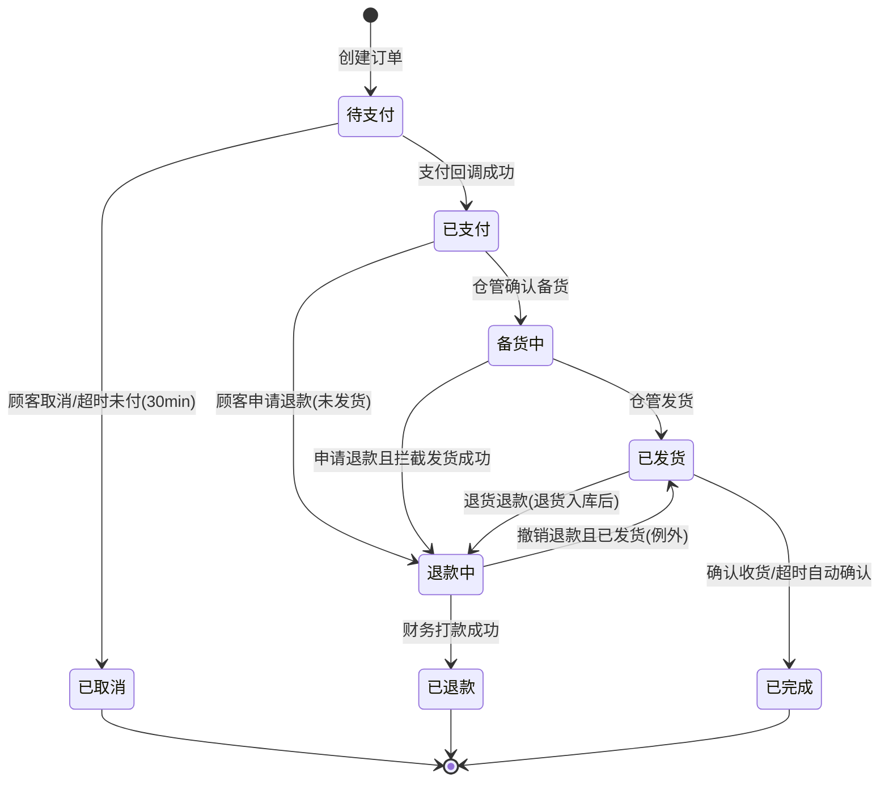
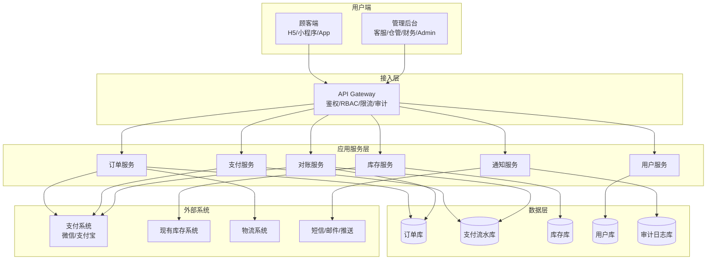
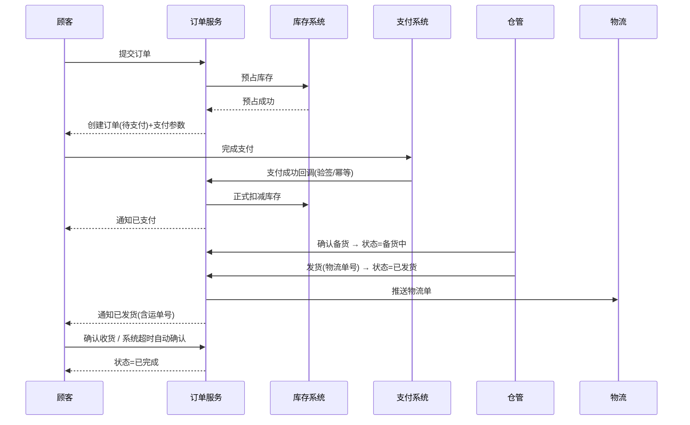
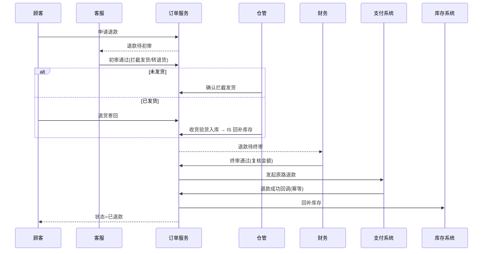
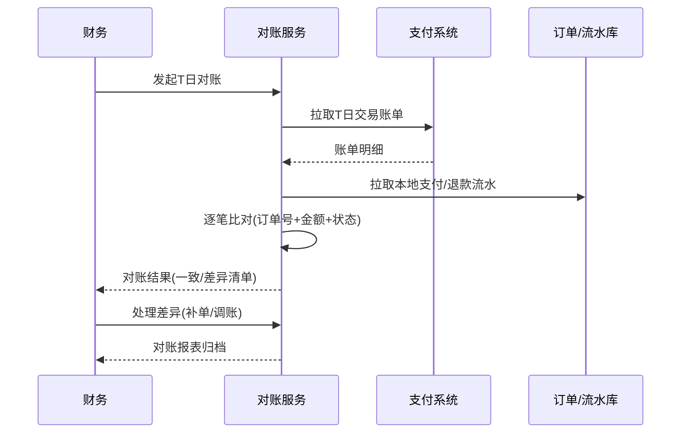

# 电商订单履约系统 产品需求文档（PRD）

| 项目 | 内容 |
| --- | --- |
| 文档名称 | 电商订单履约系统 PRD |
| 文档版本 | v1.0 |
| 文档状态 | 评审稿（供下午方案评审使用） |
| 编写日期 | 2026-08-10 |
| 编写人 | 产品组 |
| 评审对象 | 产品、研发、测试、业务方（客服/仓储/财务代表） |

> 说明：本文档为完整需求定义，覆盖**产品概述、角色与权限、订单状态机、核心业务流程、功能需求、系统架构、数据流、数据模型、非功能需求、风险与里程碑**，供下午方案汇报及后续研发排期使用。

---

## 1. 产品概述

### 1.1 背景
电商平台当前订单处理依赖人工线下流转，存在以下问题：
- 订单状态靠人工登记，顾客无法实时获知进度，催单无依据；
- 发货、退款、对账流程割裂，客服/仓管/财务各自为政，信息不同步；
- 已对接的库存系统与支付系统未在订单层面打通，存在超卖、漏单、对账差异风险。

### 1.2 目标
上线一套**订单履约系统**，实现：
1. 订单全生命周期线上化：待支付 → 已支付 → 备货中 → 已发货 → 已完成，中途支持取消/退款；
2. 对接现有**库存系统**与**支付系统**，下单校验库存、支付回调确认、发货扣库存、退款回补库存；
3. 四类角色（顾客/客服/仓管/财务）按权限协作，全程留痕可审计；
4. 财务可自动化对账，减少人工核对成本。

### 1.3 范围
**本期范围（P0）**：
- 订单创建、支付、取消、催单、退款全流程；
- 与库存系统、支付系统的对接；
- 客服改单、仓管发货/盘点、财务对账的配套功能；
- 基础权限体系（RBAC）与操作审计。

**非本期范围（P1/P2 或后续）**：
- 营销活动（优惠券、满减）的复杂拆单分摊；
- 多仓/多物流商自动路由；
- 售后（换货、维修、评价）体系。

### 1.4 关键名词
| 名词 | 定义 |
| --- | --- |
| 订单 | 顾客一次购买行为的交易凭证，包含商品明细、金额、状态 |
| 履约 | 从下单到完成收货的完整执行过程（支付、备货、发货、签收） |
| 退款单 | 针对已支付订单的退款申请及执行记录 |
| 对账 | 将订单系统交易流水与支付系统账单逐笔比对，核对资金一致性 |

---

## 2. 用户角色与权限

### 2.1 角色定义

| 角色 | 说明 | 使用端 |
| --- | --- | --- |
| 普通顾客（Customer） | 下单、支付、催单、申请退款、查看自己的订单 | 顾客端（H5/小程序/App） |
| 客服（CS Agent） | 查看全部订单、代客改单、审核退款申请、处理催单 | 管理后台 |
| 仓管（Warehouse） | 备货、发货、盘点、查询待发货订单与库存 | 管理后台 |
| 财务（Finance） | 对账、退款打款复核、交易流水查询、导出报表 | 管理后台 |
| 系统管理员（Admin） | 账号、角色、权限配置（支撑角色） | 管理后台 |

### 2.2 权限矩阵（RBAC）

> ✅ = 允许；— = 无权限。数据范围按"我的/全部/涉及款项"区分行级权限。

| 功能模块 | 操作 | 普通顾客 | 客服 | 仓管 | 财务 |
| --- | --- | --- | --- | --- | --- |
| 订单 | 创建订单 | ✅ | ✅（代客下单） | — | — |
| 订单 | 查看订单 | ✅（仅本人） | ✅（全部） | ✅（待发货/发货相关） | ✅（涉及款项） |
| 订单 | 取消订单（待支付/可取消态） | ✅（本人订单） | ✅ | — | — |
| 订单 | 修改订单（地址/商品/金额） | — | ✅（限未支付/备货中） | — | — |
| 支付 | 发起支付 | ✅ | — | — | — |
| 催单 | 发起催单 | ✅（本人订单） | ✅（代客发起） | ✅（查看催单队列） | — |
| 退款 | 申请退款 | ✅（本人订单） | ✅（代客申请） | — | — |
| 退款 | 审核退款（初审） | — | ✅ | — | — |
| 退款 | 退款打款复核（终审） | — | — | — | ✅ |
| 发货 | 确认备货 | — | — | ✅ | — |
| 发货 | 发货（录入物流单号） | — | — | ✅ | — |
| 盘点 | 发起/执行盘点 | — | — | ✅ | — |
| 对账 | 拉取账单、对账、差异处理 | — | — | — | ✅ |
| 对账 | 交易流水/报表导出 | — | — | — | ✅ |
| 系统 | 账号/角色/权限管理 | — | — | — | —（仅 Admin） |

**权限控制要点**：
1. 所有后台操作需登录 + RBAC 鉴权，接口层做二次校验（服务端鉴权，不依赖前端隐藏）；
2. 顾客仅能操作"本人订单"（按 user_id 数据隔离）；
3. 财务仅能查看与资金相关的订单字段（金额、流水），无权修改商品/地址；
4. 仓管仅能看到备货中/已发货相关字段，无权查看顾客隐私（手机号脱敏展示）；
5. 全部写操作写入审计日志（操作人、时间、变更前后值）。

---

## 3. 订单状态机（核心）

### 3.1 状态定义

| 状态码 | 状态名 | 含义 |
| --- | --- | --- |
| PENDING_PAYMENT | 待支付 | 订单已创建，等待顾客支付 |
| PAID | 已支付 | 支付成功，等待备货 |
| PREPARING | 备货中 | 仓管已接单开始拣货/打包 |
| SHIPPED | 已发货 | 已出库并录入物流单号 |
| COMPLETED | 已完成 | 顾客确认收货或超时自动确认 |
| CANCELLED | 已取消 | 未支付取消或支付后退款完成的最终态之一 |
| REFUNDING | 退款中 | 退款申请已通过，等待打款 |
| REFUNDED | 已退款 | 退款打款完成，订单关闭 |

### 3.2 状态流转图

### 3.3 状态流转规则表

| 当前状态 | 触发动作 | 操作人/系统 | 目标状态 | 约束条件 |
| --- | --- | --- | --- | --- |
| 待支付 | 支付成功回调 | 支付系统→系统 | 已支付 | 回调需验签、幂等；金额一致 |
| 待支付 | 取消订单 | 顾客/客服 | 已取消 | 仅待支付可无责取消；超时 30min 系统自动取消并释放库存 |
| 已支付 | 确认备货 | 仓管 | 备货中 | 需先锁定/扣减库存成功 |
| 已支付 | 申请退款 | 顾客/客服 | 退款中 | 未发货；需客服初审 |
| 备货中 | 发货 | 仓管 | 已发货 | 必填物流公司+运单号；扣减库存 |
| 备货中 | 申请退款 | 顾客/客服 | 退款中 | 需拦截发货成功，否则转退货流程 |
| 已发货 | 确认收货/超时 | 顾客/系统 | 已完成 | 发货后默认 15 天未确认自动完成 |
| 已发货 | 退货退款 | 顾客/客服 | 退款中 | 退货入库后发起退款 |
| 退款中 | 打款成功回调 | 支付系统→系统 | 已退款 | 财务终审通过后发起；幂等 |
| 退款中 | 撤销退款 | 客服 | 已发货/备货中 | 仅退款未打款时可撤销 |

**防并发规则**：所有状态变更走"状态机 + 乐观锁（version/条件更新 WHERE status=期望值）"，非法流转直接拒绝，防止并发重复发货/重复退款。

---

## 4. 核心业务流程

### 4.1 下单支付流程（顾客）
1. 顾客在商品页提交订单 → 系统调用**库存系统**查询并**预占库存**；
2. 预占成功 → 创建订单（待支付）→ 调用**支付系统**下单接口生成支付单，返回支付链接/二维码；
3. 顾客完成支付 → **支付系统异步回调** → 系统验签、校验金额 → 订单置为"已支付"，通知库存系统**正式扣减**；
4. 支付超时（30 分钟）未支付 → 系统自动取消订单 → 释放预占库存。

### 4.2 备货发货流程（仓管）
1. 仓管查看"待发货"队列（已支付/备货中）；
2. 仓管点击"开始备货" → 订单进入备货中（拣货单生成）；
3. 打包完成 → 录入物流公司 + 运单号 → 点击"发货" → 订单进入已发货 → 库存正式扣减 → 通知顾客（含物流单号）；
4. 顾客签收/超时 → 已完成。

### 4.3 取消/退款流程（顾客 + 客服 + 财务）
**场景 A：待支付取消**
1. 顾客点击取消 → 订单直接置为已取消 → 释放预占库存（若已预占）。

**场景 B：已支付/备货中退款（未发货）**
1. 顾客申请退款（填原因）→ 生成退款单；
2. 客服初审：通过则拦截发货 → 进入退款中；
3. 财务终审：复核金额 → 调用支付系统发起原路退款；
4. 支付系统退款成功回调 → 订单置为已退款 → 库存回补。

**场景 C：已发货退货退款**
1. 顾客申请退货退款 → 客服审核通过 → 生成退货单；
2. 顾客寄回 → 仓管收货验货入库（库存回补）→ 确认退货完成；
3. 财务终审打款 → 已退款。

### 4.4 催单流程
1. 顾客在"待发货/备货中"订单上点击"催单"（限 1 次/订单/24h）；
2. 系统生成催单记录 → 推送至仓管待办队列；
3. 仓管处理（优先发货或回复预计时间）→ 系统通知顾客处理结果。

### 4.5 盘点流程（仓管）
1. 仓管发起盘点单（全盘/抽盘）→ 系统锁定盘点范围库存；
2. 仓管录入实盘数量 → 系统与账面数量比对生成差异；
3. 差异确认后生成库存调整单（出入库记录），差异大时触发财务/管理员复核。

### 4.6 对账流程（财务）
1. 财务选择账期（T 日）发起对账 → 系统从**支付系统**拉取交易账单；
2. 与订单系统支付/退款流水逐笔比对（订单号、金额、时间、状态）；
3. 输出对账结果：一致 / 差异（长款、短款、状态不一致、遗漏单）；
4. 差异人工处理（补单、调账、提交工单）→ 生成对账报表并归档。

---

## 5. 功能需求

> 优先级：P0 = 本期必须；P1 = 本期尽量；P2 = 后续迭代。

### 5.1 订单模块
| 编号 | 功能 | 说明 | 优先级 |
| --- | --- | --- | --- |
| F-ORD-01 | 创建订单 | 商品、数量、地址、金额校验，预占库存 | P0 |
| F-ORD-02 | 订单查询 | 多条件筛选（状态/时间/单号/角色数据范围） | P0 |
| F-ORD-03 | 取消订单 | 状态机约束下取消，释放库存 | P0 |
| F-ORD-04 | 修改订单 | 客服改地址/商品/金额（限未支付、备货中），记录审计 | P0 |
| F-ORD-05 | 订单详情 | 含商品、金额、状态时间线、物流、退款信息 | P0 |
| F-ORD-06 | 超时自动关闭 | 待支付 30min 自动取消（可配置） | P0 |

### 5.2 支付模块（对接支付系统）
| 编号 | 功能 | 说明 | 优先级 |
| --- | --- | --- | --- |
| F-PAY-01 | 支付下单 | 调用支付系统生成支付单 | P0 |
| F-PAY-02 | 支付回调处理 | 验签、幂等、状态落库 | P0 |
| F-PAY-03 | 退款发起 | 原路退款调用 | P0 |
| F-PAY-04 | 退款回调处理 | 退款结果落库、库存回补 | P0 |
| F-PAY-05 | 支付/退款流水查询 | 供财务与客服查询 | P0 |
| F-PAY-06 | 支付结果主动查询 | 回调丢失时的补偿查询（定时任务） | P1 |

### 5.3 库存对接模块（对接库存系统）
| 编号 | 功能 | 说明 | 优先级 |
| --- | --- | --- | --- |
| F-INV-01 | 库存预占 | 下单时预占，防超卖 | P0 |
| F-INV-02 | 库存扣减 | 支付成功/发货时扣减 | P0 |
| F-INV-03 | 库存回补 | 取消/退款时回补 | P0 |
| F-INV-04 | 库存查询 | 仓管查询可售/在途/锁定库存 | P0 |
| F-INV-05 | 盘点 | 盘点单、实盘录入、差异调整 | P1 |
| F-INV-06 | 缺货处理 | 备货时发现缺货 → 提示客服联系顾客改单/退款 | P1 |

### 5.4 退款模块
| 编号 | 功能 | 说明 | 优先级 |
| --- | --- | --- | --- |
| F-REF-01 | 申请退款 | 顾客/客服发起，填写原因 | P0 |
| F-REF-02 | 退款初审 | 客服审核（通过/驳回/转退货） | P0 |
| F-REF-03 | 退款终审 | 财务复核金额后打款 | P0 |
| F-REF-04 | 退货流程 | 退货单、收货验货、入库回补 | P1 |
| F-REF-05 | 退款进度通知 | 状态变化通知顾客 | P1 |

### 5.5 催单模块
| 编号 | 功能 | 说明 | 优先级 |
| --- | --- | --- | --- |
| F-URG-01 | 发起催单 | 频控 1 次/订单/24h | P1 |
| F-URG-02 | 催单队列 | 仓管待办，按催单时间排序 | P1 |
| F-URG-03 | 催单处理反馈 | 仓管回复后通知顾客 | P1 |

### 5.6 对账模块
| 编号 | 功能 | 说明 | 优先级 |
| --- | --- | --- | --- |
| F-REC-01 | 账单拉取 | 从支付系统拉取对账单 | P0 |
| F-REC-02 | 自动对账 | 逐笔比对并标记差异 | P0 |
| F-REC-03 | 差异处理 | 差异清单、人工处理、状态跟踪 | P0 |
| F-REC-04 | 对账报表 | 汇总报表与明细导出 | P1 |

### 5.7 通知模块
| 编号 | 功能 | 说明 | 优先级 |
| --- | --- | --- | --- |
| F-NTF-01 | 订单状态通知 | 支付成功/发货/完成/退款各环节通知顾客 | P0 |
| F-NTF-02 | 待办通知 | 客服退款待审、仓管发货待办、财务对账待办 | P1 |

---

## 6. 系统架构

### 6.1 架构图

### 6.2 模块职责
| 模块 | 职责 |
| --- | --- |
| 订单服务 | 订单生命周期管理、状态机、取消/退款单据、催单 |
| 支付服务 | 支付/退款调用、回调处理、幂等、流水 |
| 库存服务 | 库存预占/扣减/回补，对接现有库存系统 |
| 对账服务 | 账单拉取、逐笔比对、差异管理 |
| 通知服务 | 站内信/短信/推送模板化发送 |
| 用户服务 | 账号、角色、权限（RBAC）、鉴权 |
| API Gateway | 统一入口、鉴权、限流、审计日志采集 |

### 6.3 技术要点（建议）
- 服务间通过 API 同步调用 + 消息队列（订单事件：支付成功、已发货等）解耦；
- 支付回调、退款回调采用**幂等键**（订单号+事件类型）去重；
- 状态变更使用**乐观锁 + 状态机校验**，杜绝并发脏写；
- 关键交易数据（订单、流水）只增不改，状态变化写审计日志；
- 对接外部系统（库存/支付）失败时启用**本地事件表 + 重试补偿**，保证最终一致。

---

## 7. 数据流

### 7.1 主数据流：下单 → 支付 → 发货 → 完成

### 7.2 退款数据流

### 7.3 对账数据流

### 7.4 关键外部接口
| 接口 | 方向 | 说明 | 幂等策略 |
| --- | --- | --- | --- |
| 库存预占/释放/扣减/回补 | 本系统 → 库存系统 | 实时同步，失败则订单流程中止并回滚 | 预占单号唯一 |
| 库存查询 | 本系统 → 库存系统 | 下单/盘点前查询 | — |
| 支付下单 | 本系统 → 支付系统 | 生成支付单 | 订单号唯一 |
| 支付结果回调 | 支付系统 → 本系统 | 异步通知 | 幂等键去重 |
| 退款申请 | 本系统 → 支付系统 | 原路退款 | 退款单号唯一 |
| 退款结果回调 | 支付系统 → 本系统 | 异步通知 | 幂等键去重 |
| 账单拉取 | 本系统 → 支付系统 | 对账用 | 账期+商户号 |

---

## 8. 数据模型（核心表）

| 表 | 关键字段 | 说明 |
| --- | --- | --- |
| orders | id, order_no, user_id, status, total_amount, pay_amount, address_snapshot, created_at, updated_at, version | 订单主表，version 用于乐观锁 |
| order_items | id, order_id, sku_id, product_name, price, quantity, subtotal | 订单商品明细 |
| payment_transactions | id, order_id, pay_channel, pay_no, amount, status, callback_time, idempotent_key | 支付流水 |
| refund_requests | id, order_id, refund_no, reason, status, amount, approver_id, review_time | 退款单（初审/终审状态） |
| shipments | id, order_id, logistics_company, tracking_no, ship_time, operator_id | 发货记录 |
| stock_movements | id, sku_id, order_id, change_type(预占/扣减/回补/盘点), quantity, created_at | 库存变动流水 |
| urge_records | id, order_id, user_id, content, status, handler_id, handled_at | 催单记录 |
| reconciliation_records | id, biz_date, status, total_count, diff_count, report_url | 对账任务与结果 |
| audit_logs | id, operator_id, action, target_type, target_id, before, after, created_at | 操作审计 |

---

## 9. 非功能需求

| 类别 | 要求 |
| --- | --- |
| 性能 | 下单接口 P95 < 500ms；订单查询列表 P95 < 1s；支持日常并发 500 QPS、峰值 2000 QPS（可扩展） |
| 可用性 | 核心链路（下单/支付回调）可用性 ≥ 99.9%；支付回调不丢失（本地事件表 + 重试） |
| 一致性 | 订单与支付/库存最终一致；对账 T+1 完成；状态变更严格按状态机 |
| 安全 | RBAC 权限、接口鉴权；支付回调验签；敏感信息（手机号/地址）脱敏；全链路 HTTPS |
| 审计 | 所有资金与状态变更操作留痕，审计日志保留 ≥ 180 天 |
| 数据 | 订单数据保留 ≥ 3 年；每日全量备份 + 实时增量 |
| 合规 | 退款原路退回；发票/资金流水符合财务规范 |

---

## 10. 风险与应对

| 风险 | 影响 | 应对 |
| --- | --- | --- |
| 支付回调重复/丢失 | 订单状态错乱、漏单 | 幂等键去重 + 定时主动查询补偿 |
| 库存超卖 | 缺货客诉 | 下单预占库存，扣减失败拦截发货 |
| 并发重复发货/重复退款 | 资金损失 | 状态机 + 乐观锁条件更新 |
| 对账差异 | 资金不平 | 逐笔比对 + 差异工单人工处理 |
| 外部系统不可用 | 下单/支付中断 | 降级提示、本地事件表重试、监控告警 |
| 客服误改单 | 客诉 | 修改权限限制 + 审计日志 + 变更审批 |

---

## 11. 里程碑与验收

| 里程碑 | 内容 | 预计周期 | 验收标准 |
| --- | --- | --- | --- |
| M1 | 订单 + 支付核心链路（下单、支付回调、取消） | 2 周 | 下单→支付→已支付全链路跑通，回调幂等验证通过 |
| M2 | 备货发货 + 库存对接 | 1.5 周 | 发货扣库存、取消/退款回补库存正确，无超卖 |
| M3 | 退款 + 催单 + 对账 | 2 周 | 三种退款场景跑通；对账一致率 100%（测试数据） |
| M4 | 权限 + 审计 + 全量回归上线 | 1 周 | 权限矩阵逐项验收通过；审计日志完整 |

**总体上线验收**：四类角色权限隔离验证通过；订单全状态流转（含取消/退款）用例全绿；与库存、支付系统联调通过；对账报表与实际账单一致。

---

## 附录 A：本次设计假设（需确认）

以下为基于现有信息做出的合理假设，请评审时确认：
1. 顾客端为 H5/小程序，管理后台为 Web（若仅有 Web 端，顾客端功能改为后台代操作）；
2. 支付系统为微信/支付宝（原路退款适用），提供异步回调与账单拉取能力；
3. 库存系统已有"查询/预占/扣减/回补"接口，本系统只对接不改动；
4. 待支付超时自动取消时间为 30 分钟（可配置）；
5. 已发货订单退款按"退货退款"处理；未发货按"仅退款"处理；
6. 财务对账为 T+1 日终对账；
7. 商品 SKU 为统一编码，与库存系统一致。

## 附录 B：待确认问题清单
1. 是否需要支持部分退款 / 部分发货？
2. 取消订单是否收取违约金（如已支付后取消）？
3. 是否存在线下付款（货到付款）场景？
4. 是否需要对接发票系统？
5. 催单是否需 SLA 承诺（如 24h 内必须处理）？
